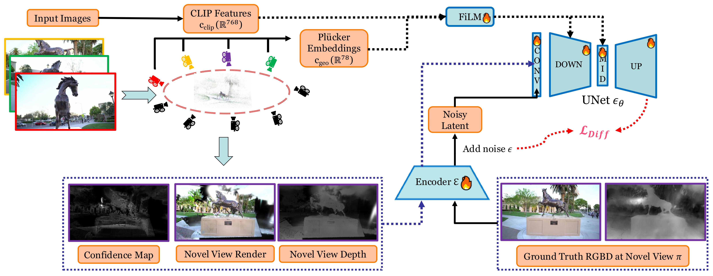

<h1 align="center">
Gaussian Scenes: Pose-Free Sparse-View Scene Reconstruction using Depth-Enhanced Diffusion Priors
</h1>

<a href="https://mvp18.github.io"><strong>Soumava Paul</strong></a>, <a href="https://toshi2k2.github.io/"><strong>Prakhar Kaushik</strong></a>, <a href="https://www.cs.jhu.edu/~ayuille/"><strong>Alan Yuille</strong></a>

<h3 align="center">
<a href="https://arxiv.org/abs/2411.15966">TMLR 2025</a>
</h3>

### Abstract

In this work, we introduce a generative approach for pose-free (without camera parameters) reconstruction of 360° scenes from a sparse set of 2D images. Pose-free scene reconstruction from incomplete, pose-free observations is usually regularized with depth estimation or 3D foundational priors. While recent advances have enabled sparse-view reconstruction of large complex scenes (with high degree of foreground and background detail) with known camera poses using view-conditioned generative priors, these methods cannot be directly adapted for the pose-free setting when ground-truth poses are not available during evaluation. To address this, we propose an image-to-image generative model designed to inpaint missing details and remove artifacts in novel view renders and depth maps of a 3D scene. We introduce context and geometry conditioning using Feature-wise Linear Modulation (FiLM) modulation layers as a lightweight alternative to cross-attention and also propose a novel confidence measure for 3D Gaussian splat representations to allow for better detection of these artifacts. By progressively integrating these novel views in a Gaussian-SLAM-inspired process, we achieve a multi-view-consistent 3D representation. Evaluations on the MipNeRF360 and DL3DV-10K benchmark dataset demonstrate that our method surpasses existing pose-free techniques and performs competitively with state-of-the-art posed (precomputed camera parameters are given) reconstruction methods in complex 360° scenes. Our [project page](https://gaussianscenes.github.io) provides additional results, videos, and code.

### Implementation

Currently refactoring the code. Next update by July 21. Feel free to raise an issue in case of any queries. 